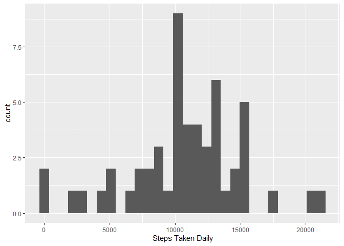
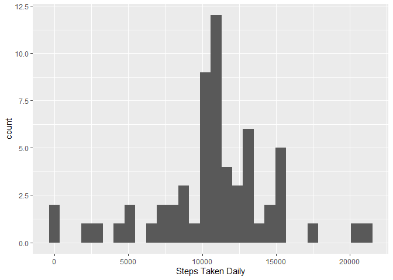
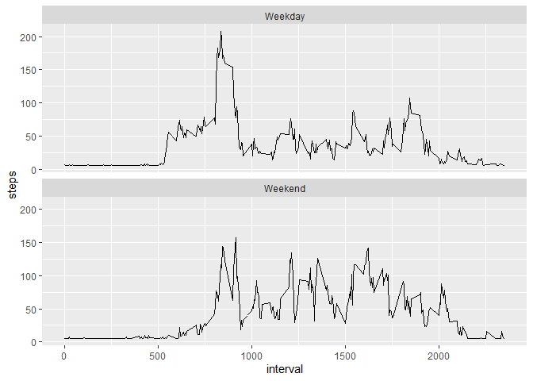

## Loading and preprocessing the data

Firstly, I loaded the data from the working directory by using read.csv and subsequently used str() to get a rough idea of the data.


```r
data <- read.csv("F:/DS/Course 5/Week 2/repdata_data_activity/activity.csv", header = TRUE, sep = ",")

str(data)
```

```
## 'data.frame':	17568 obs. of  3 variables:
##  $ steps   : int  NA NA NA NA NA NA NA NA NA NA ...
##  $ date    : Factor w/ 61 levels "2012-10-01","2012-10-02",..: 1 1 1 1 1 1 1 1 1 1 ...
##  $ interval: int  0 5 10 15 20 25 30 35 40 45 ...
```

I found that the 'date' column was factor and had to be changed to date format for subsequent work using ymd().


```r
library(lubridate)
```

```
## 
## Attaching package: 'lubridate'
```

```
## The following object is masked from 'package:base':
## 
##     date
```

```r
#converting data for usage
data$date <- ymd(data$date)
```
## What is mean total number of steps taken per day?

After the basic conversion to required format, I removed the NAs as designated in part 1 of the assignment and summed up the steps taken daily.


```r
library(dplyr)
```

```
## 
## Attaching package: 'dplyr'
```

```
## The following objects are masked from 'package:lubridate':
## 
##     intersect, setdiff, union
```

```
## The following objects are masked from 'package:stats':
## 
##     filter, lag
```

```
## The following objects are masked from 'package:base':
## 
##     intersect, setdiff, setequal, union
```

```r
#calculating steps taken daily
daily_steps <- data %>% filter(!is.na(steps))  %>% group_by(date) %>% summarise(steps = sum(steps)) %>% print
```

```
## # A tibble: 53 x 2
##    date       steps
##    <date>     <int>
##  1 2012-10-02   126
##  2 2012-10-03 11352
##  3 2012-10-04 12116
##  4 2012-10-05 13294
##  5 2012-10-06 15420
##  6 2012-10-07 11015
##  7 2012-10-09 12811
##  8 2012-10-10  9900
##  9 2012-10-11 10304
## 10 2012-10-12 17382
## # ... with 43 more rows
```

Subsequently, made a histogram of the steps taken daily :

```r
library(ggplot2)
#histogram of steps taken daily
ggplot(data=daily_steps, aes(x=steps))  + geom_histogram()+labs(x = "Steps Taken Daily")
```

```
## `stat_bin()` using `bins = 30`. Pick better value with `binwidth`.
```

<!-- -->

and took the mean and median of the data as stated:

```r
#mean of steps
mean(daily_steps$steps)
```

```
## [1] 10766.19
```

```r
#median
median(daily_steps$steps)
```

```
## [1] 10765
```

## What is the average daily activity pattern?

Next was making a time series plot, For it first I calculated the average steps depending by grouping the data by interval.

```r
#average steps by 5 minute interval
average_steps <- data %>% filter(!is.na(steps)) %>% group_by(interval) %>% summarise(steps = mean(steps)) %>% print
```

```
## # A tibble: 288 x 2
##    interval  steps
##       <int>  <dbl>
##  1        0 1.72  
##  2        5 0.340 
##  3       10 0.132 
##  4       15 0.151 
##  5       20 0.0755
##  6       25 2.09  
##  7       30 0.528 
##  8       35 0.868 
##  9       40 0     
## 10       45 1.47  
## # ... with 278 more rows
```

```r
#making a time series by interval
ggplot(data = average_steps, aes(x = interval, y = steps)) + geom_line()
```

<!-- -->
Subsequently, calculated the maximum steps taken in a single 5 minute interval.

```r
#maximum number of steps in a time interval
average_steps[which.max(average_steps$steps),]
```

```
## # A tibble: 1 x 2
##   interval steps
##      <int> <dbl>
## 1      835  206.
```

## Imputing missing values

The next part of the assignment required me to identfy the NA rows available.

```r
#total number of rows having NAs
length(grepl("NA", as.character(data$steps), ignore.case = TRUE))
```

```
## [1] 17568
```
Further I decided to replace the NAs by the average steps for that interval to compare the result with and without the NAs.

```r
#replacing NAs with the mean of the respective groups accoring to the interval
data1 <- data %>% group_by(interval)
data1$steps[is.na(data1$steps)] <- mean(data1$steps, na.rm=TRUE)
```
After that, following the earlier check of steps taken daily, again I made a histogram using the same technique.

```r
#calculating steps taken daily
daily_steps1 <- data1   %>% group_by(date) %>% summarise(steps = sum(steps)) %>% print
```

```
## # A tibble: 61 x 2
##    date        steps
##    <date>      <dbl>
##  1 2012-10-01 10766.
##  2 2012-10-02   126 
##  3 2012-10-03 11352 
##  4 2012-10-04 12116 
##  5 2012-10-05 13294 
##  6 2012-10-06 15420 
##  7 2012-10-07 11015 
##  8 2012-10-08 10766.
##  9 2012-10-09 12811 
## 10 2012-10-10  9900 
## # ... with 51 more rows
```

```r
ggplot(data=daily_steps1, aes(x=steps))  + geom_histogram()+labs(x = "Steps Taken Daily")
```

```
## `stat_bin()` using `bins = 30`. Pick better value with `binwidth`.
```

<!-- -->
And also checking to compare the mean and median,

```r
#mean of steps
mean(daily_steps1$steps)
```

```
## [1] 10766.19
```

```r
#median
median(daily_steps1$steps)
```

```
## [1] 10766.19
```
After imputing the NAs with the mean value of the respective interval, I found the data to be not so different. There is a slight variation but negligible according to the graph. The mean and median are also almost the same.


## Are there differences in activity patterns between weekdays and weekends?

In order to get an idea of the step taken on weekdays and weekend, I made another column differentiating the weekends from the weekdays.

```r
#Making a new variable determining days of week
data2 <- mutate(data1, days = weekdays(as.POSIXct(date), abbreviate = F))

#renaming as weekends and weekdays
data2$days <- gsub("saturday|sunday", "Weekend", data2$days, ignore.case = TRUE)


data2$days <- gsub("monday|tuesday|wednesday|thursday|friday", "Weekday", data2$days, ignore.case = TRUE)
```
Calculated the average steps per interval throughout the study:

```r
#Calculating the average steps per interval
daily_steps2 <- data2   %>% group_by(interval,days) %>% summarise(steps = mean(steps)) %>% print
```

```
## # A tibble: 576 x 3
## # Groups:   interval [288]
##    interval days    steps
##       <int> <chr>   <dbl>
##  1        0 Weekday  7.01
##  2        0 Weekend  4.67
##  3        5 Weekday  5.38
##  4        5 Weekend  4.67
##  5       10 Weekday  5.14
##  6       10 Weekend  4.67
##  7       15 Weekday  5.16
##  8       15 Weekend  4.67
##  9       20 Weekday  5.07
## 10       20 Weekend  4.67
## # ... with 566 more rows
```
And finally making a plot to compare the results,

```r
#making a time series by interval
ggplot(data = daily_steps2, aes(x = interval, y = steps)) + geom_line() +   facet_wrap(~days, ncol = 1, nrow=2)
```

<!-- -->


The comparison shows that the activity though peaks more during the weekdays but the activity during the weekend tends to be more.


